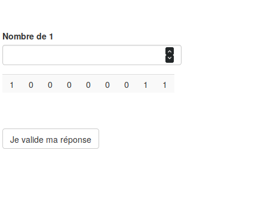

# Consigne

Durant cette tâche, vous verrez à l'écran l'heure affichée. Par intermittence, cet écran apparaitra :

Vous aurez alors **15 secondes** pour compter le nombre de *1* dans le tableau et renseigner le résultat dans le champ à gauche.

A la fin de cette tâche vous gagnerez **4€**.

Attention: Si 30% ou plus de vos décomptes sont faux durant l'expérience vous ne toucherez que 2€ !

