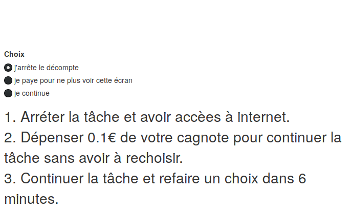

# Consigne

Cette tâche se déroulera comme la précédente. 
**Mais** toutes les **6 minutes**, vous aurez la possibilité de choisir ce que vous voulez faire pour le reste de la tâche.
Vous devrez choisir entre **trois** alternatives :

1. Arréter la tâche et avoir accès à internet.
2. Dépenser **0.1€** de votre cagnote pour continuer la tâche sans avoir à rechoisir.
3. Continuer la tâche et refaire un choix dans **6 minutes**.

Vous aurez **1 minute** pour prendre votre décision en selectionnant le bouton correspondant sur cet écran : 

A la fin de cette tâche votre cagnote sera créditée de :

* **0€** si vous avez continué la tâche pendant moins de 15 minutes.
* **2€** si vous avez continué la tâche pendant plus de 15 minutes et moins de 30 minutes.
* **4€** si vous avez continué la tâche pendant les 30 minutes.

Attention: Si 30% ou plus de vos décomptes sont faux durant l'expérience vous ne toucherez que 2€ !

