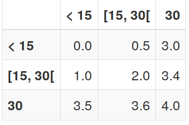

# Consigne

Cette tâche se déroulera comme la précédente. 
**Excepter** que vous êtes maintenant appareiller avec une autre personne dans
la salle.
La seule information que vous recevrez sur cette personne, sera le choix 
qu'elle fera durant cette tâche.
A partir du second choix, vous verrez apparaitre sur l'écran de choix la 
décision qui a été prise par votre partenaire à la période précédente.

A la fin de la période, la somme qui vous sera créditée dépendra du temps que 
vous et votre partenaire avez consacré à la tâche. Le payement se fera selon le tableau ci-dessous :

En lignes le temps que vous aurez passé à la tâche et en colones le temps passé par votre partenaire. Avec :  

> __< 15__ avoir passé moins de 15 minutes à la tâche.  
> __[15, 30[__ avoir passé plus de 15 minutes à la tâche et moins de 30 minutes.  
> __30__ avoir passé les 30 minutes à la tâche.  

 
 

Attention: Si 30% ou plus de vos décomptes sont faux durant l'expérience vous ne toucherez que 2€ !

